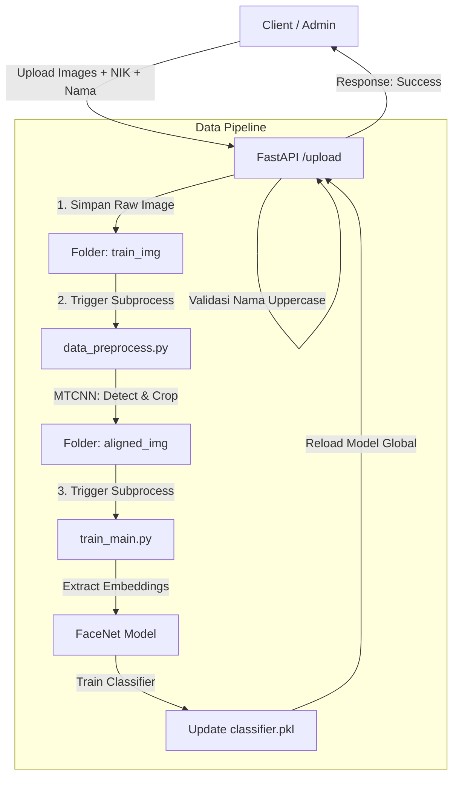
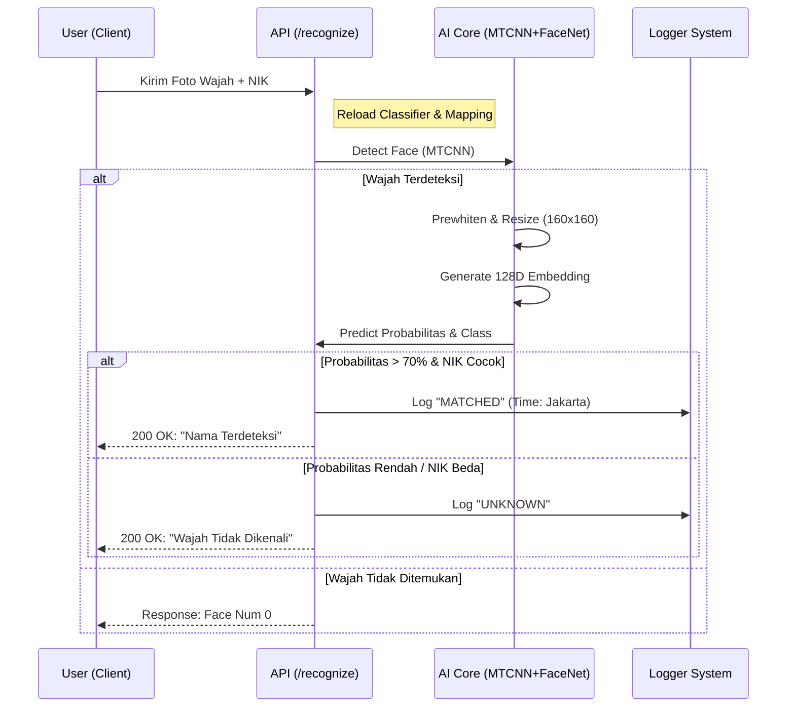

<div align="center">

# 🧠 Face Recognition System API
### Powered by MTCNN & FaceNet


<br>

**Sistem Absensi Cerdas berbasis Biometrik Wajah.**
<br>
*Backend API yang menangani registrasi wajah, pelatihan model otomatis, deteksi (MTCNN), dan pengenalan identitas (FaceNet).*

[Lihat Profil Saya](https://github.com/YeQiu29) · [Laporkan Bug](https://github.com/YeQiu29/Face-Recognition-MTCNN-FastAPI/issues)

</div>

---

## 📖 Tentang Project

Project ini adalah backend service (`Microservice`) yang dibangun menggunakan **FastAPI**. Sistem ini tidak hanya sekedar mendeteksi wajah, tetapi memiliki pipeline lengkap mulai dari preprocessing gambar, *alignment* wajah, hingga pelatihan model klasifikasi secara otomatis saat data baru ditambahkan.

### 🔥 Fitur Utama

* **Hybrid AI Engine:** Menggunakan **MTCNN** (Multi-task Cascaded Convolutional Networks) untuk deteksi wajah yang presisi dan **FaceNet** (Inception ResNet v1) untuk ekstraksi fitur embedding.
* **Auto-Retraining:** Saat user mengupload foto baru via API, sistem otomatis melakukan *preprocessing* dan *training* ulang model klasifikasi (`classifier.pkl`) di background.
* **Live Logging:** Mencatat setiap percobaan absensi (berhasil/gagal) ke dalam file log harian dengan zona waktu Asia/Jakarta.
* **Strict Validation:** Membandingkan NIK input dengan hasil prediksi wajah untuk memastikan validitas absensi (Threshold > 0.7).
* **GPU Accelerated:** Mendukung penggunaan GPU Memory Fraction untuk performa inferensi yang lebih cepat.

---

## 🧩 Arsitektur & Alur Kerja

Berikut adalah logika bagaimana sistem ini bekerja di belakang layar berdasarkan kode sumber.

### 1. Alur Registrasi & Training (Upload Endpoint)


### 2. Alur Pengenalan Wajah (Recognize Endpoint)

## 📂 Struktur Direktori
```Plaintext
Face-Recognition-MTCNN-FastAPI/
├── aligned_img/         # Hasil crop wajah yang sudah dirapikan (MTCNN)
├── class/               # Menyimpan file classifier.pkl (Model SVM)
├── logging/             # File log absensi (format: logging_dd-mm-yyyy.txt)
├── model/               # Pre-trained FaceNet model (.pb)
├── npy/                 # Bobot Numpy untuk MTCNN
├── train_img/           # Data mentah foto wajah user
├── app_face.py          # Script pendukung aplikasi
├── classifier.py        # Logic klasifikasi
├── data_preprocess.py   # Script untuk preprocessing gambar
├── detect_face.py       # Core logic deteksi wajah MTCNN
├── facenet.py           # Utility untuk FaceNet
├── main.py              # 🚀 MAIN APP (FastAPI Entry Point)
├── train_main.py        # Script untuk mentraining ulang model
└── requirements.txt     # Daftar dependency
```
## 🚀 Cara Instalasi & Menjalankan
Pastikan Anda memiliki Python 3.7+ dan driver CUDA jika menggunakan GPU.

1. Clone Repository
```bash
git clone [https://github.com/YeQiu29/Face-Recognition-MTCNN-FastAPI.git](https://github.com/YeQiu29/Face-Recognition-MTCNN-FastAPI.git)
cd Face-Recognition-MTCNN-FastAPI
```
2. Install Dependencies
```bash
pip install -r requirements.txt
```
Note: Pastikan tensorflow-gpu atau tensorflow versi kompatibel terinstall.
3. Siapkan Model
Pastikan file model 20180402-114759.pb sudah ada di folder model/.
4. Jalankan Server
```bash
# Menjalankan server pada port 8006 (sesuai kode)
python main.py
# Atau via uvicorn terminal:
# uvicorn main:app --host 0.0.0.0 --port 8006 --reload
```
## 📡 Dokumentasi API
Dokumentasi interaktif (Swagger UI) dapat diakses di: http://localhost:8006/docs

1. POST /upload/
Digunakan untuk mendaftarkan user baru.
> Form Data:
  > nik: String (Nomor Induk Karyawan)
  > nama: String (Harus HURUF KAPITAL, cth: DENNIS)
  > files: Array of Images (Max 100 files)

2. POST /recognize/
Digunakan untuk absensi/verifikasi.
> Form Data:
  > nik_input: String (NIK yang akan diverifikasi)
  > file: Single Image File
Contoh Response (JSON):
```JSON
{
  "results": [
    {
      "nik": "12345",
      "name": "DENNIS",
      "accuracy": 0.985
    }
  ],
  "nik_input": "12345",
  "nik_matched": true,
  "face_num": 1,
  "message": "DENNIS TERDETEKSI"
}
```
## 📝 Format Logging
Sistem secara otomatis membuat file log di folder logging/ dengan format nama logging_dd-mm-yyyy.txt.

Isi log:
```Plaintext
08:30:01 - NIK: 12345, Name: DENNIS, Accuracy: 0.9823, Matched: True
08:35:12 - NIK: 99999, Name: Unknown, Accuracy: 0.4211, Matched: False
```
<div align="center"> <p> Created with ❤️ using <b>Python & TensorFlow</b> by <a href="https://github.com/YeQiu29"><b>Dennis Putra Hilmansyah</b></a> </p> </div>
